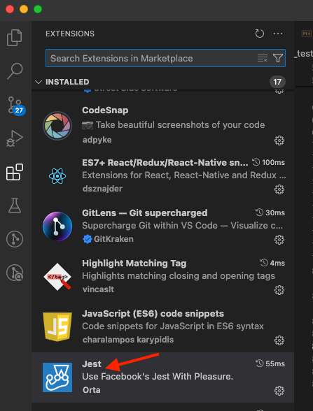

## To write test cases using jest and RTL
1. Make sure to install all the below dependencies 

```js
npm install --save-dev @babel/core @babel/preset-env @babel/preset-react @babel/preset-typescript @testing-library/jest-dom @testing-library/react @types/jest babel-jest @types/testing-library__jest-dom identity-obj-proxy jest jest-environment-jsdom ts-jest ts-node
```
-----

2. In the scripts section of package.json, make sure to add this

```js
"test": "jest"
```
-----

3. Create a **`.babelrc`** file in **`src`** folder

```js
{
  "presets": [
    "@babel/preset-env",
    "@babel/preset-react",
    "@babel/preset-typescript"
  ]
}

```
-----

4. Create a **`setupTests.ts`** file in **`src`** folder

```js
import '@testing-library/jest-dom';
```
-----

5. Create a **`jest.config.js`** file in **`root`** folder

```js
import type { Config } from '@jest/types';

const config: Config.InitialOptions = {
  transform: {
    '^.+\\.(ts|tsx)$': 'ts-jest', // Use ts-jest for TypeScript files
    '^.+\\.(js|jsx)$': 'babel-jest', // Use babel-jest for JavaScript files
  },
  testEnvironment: 'jest-environment-jsdom', // Use jsdom environment for testing
  setupFilesAfterEnv: ['<rootDir>/src/setupTests.ts'], // Path to setupTests file in src folder
  moduleFileExtensions: ['ts', 'tsx', 'js', 'jsx'], // Supported file extensions
  moduleNameMapper: {
    '\\.(css|scss|sass)$': 'identity-obj-proxy', // Mock CSS module imports
  },
};

export default config;
```
-----

## 6. Create a tsconfig.json file in the root folder

```js
{
  "compilerOptions": {
    "target": "es6", // Specify ECMAScript target version
    "module": "commonjs", // Specify module code generation
    "lib": ["dom", "dom.iterable", "esnext"], // Specify library files to be included
    "allowJs": true, // Allow JavaScript files to be compiled
    "skipLibCheck": true, // Skip type checking of declaration files
    "esModuleInterop": true, // Enable interoperability between CommonJS and ES Modules
    "allowSyntheticDefaultImports": true, // Allow default imports from modules with no default export
    "strict": true, // Enable all strict type-checking options
    "forceConsistentCasingInFileNames": true, // Ensure consistent casing in file names
    "noFallthroughCasesInSwitch": true, // Report errors for fallthrough cases in switch statements
    "moduleResolution": "node", // Use Node.js module resolution strategy
    "resolveJsonModule": true, // Include modules imported with .json extension
    "isolatedModules": true, // Ensure TypeScript files can be safely transpiled by themselves
    "jsx": "react-jsx", // Specify JSX code generation (React 17+)
    "types": ["jest", "@testing-library/jest-dom"], // Include type definitions for Jest and RTL
    "outDir": "./dist" // Specify output directory for compiled files
  },
  "include": [
    "src", // Include all files in the src directory
    "setupTests.ts" // Include the setupTests.ts file
  ],
  "exclude": [
    "node_modules", // Exclude the node_modules directory
    "dist" // Exclude the dist directory
  ]
}
```

### Change the .eslintrc.js file if it is required

-----


## 7. Procedure to see whether test cases are passed or failed

### Procedure - 1
- right click on the **jsx_testCases** folder and select **Open in Integrated terminal**
- Type **npm test** command in vs-code terminal and click **enter**

----

### Procedure - 2
- click on the **`+`** icon on vscode-terminal and select **Javascript Debug terminal**


- **`Right`** click on the **jsx_testCases** folder and select **Copy Relative Path** option


- Now do the **Ctrl + V** on **Javascript Debug Terminal (vscode)** and click **`enter`**, for example REFER BELOW

```js
//ex:
cd 01_accordion/jsx_testCases
npm test
```
- run the **npm test** command

----

### Procedure - 3

- **`Install`** the **Jest extension (Orta)** in vs-code



- Post installation for the first time, **`close`** your vscode application completely and then **`open`** it
- Now go to any **`.test.jsx`** file and right click anywhere in that code file and select **`Jest: Run Related Tests`** option
- This is my own favorite to identify particular failed/passed test case(s)


- Additionally you can click on any .test.tsx file and right click on **Run Jest on path** option

----
